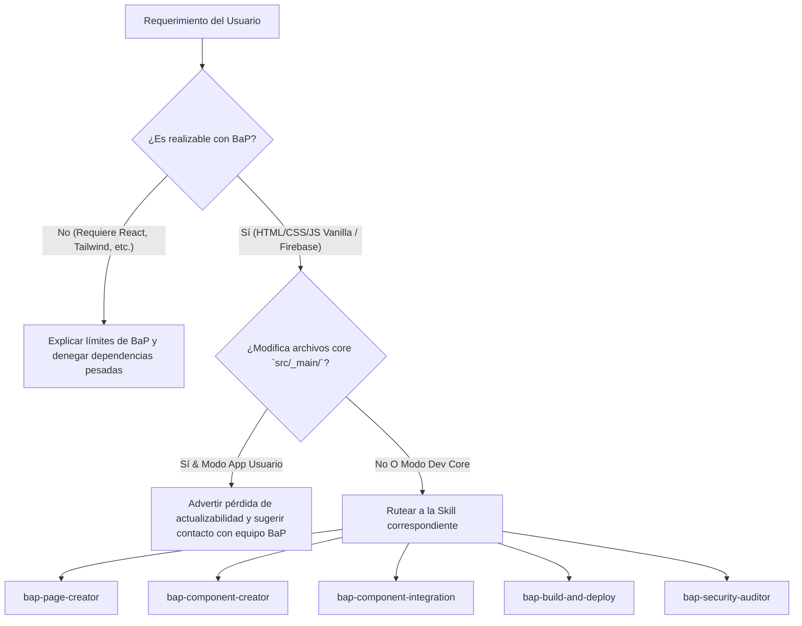

# BaP Framework - Skill Orquestadora Pivote (`bap-orchestrator`)

Esta skill actúa como el punto central de coordinación y evaluación de capacidades para cualquier interacción en proyectos que utilicen **BaP Framework**.

---

## 🚦 Flujo de Evaluación Inicial

Ante cada requerimiento del usuario, sigue este flujo de decisión:

---

## 📋 Matriz de Enrutamiento a Skills

1. **Creación de Vistas / Secciones / Rutas**:
   - Activar la skill **`bap-page-creator`**.
   - Asegura la consulta de componentes `bap-header`/`bap-footer` o personalizados, el registro en `bap.config.json`, llaves en i18n, SEO y tests unitarios.

2. **Creación de Nuevos Web Components aislados**:
   - Activar la skill **`bap-component-creator`**.
   - Garantiza que **no se use el prefijo `bap-`** (reservado para el core), consulta/sugiere un prefijo de app (ej. `app-`), crea tests unitarios y actualiza el patio de pruebas.

3. **Inclusión / Configuración de Componentes Core Nativos (`bap-dialog`, `bap-header`, `bap-toast`, etc.)**:
   - Activar la skill **`bap-component-integration`**.
   - Consulta destino y opciones de personalización permitidas.

4. **Compilación, Optimización o Despliegue a Firebase**:
   - Activar la skill **`bap-build-and-deploy`**.
   - Ejecuta tests, valida entorno de producción y **solicita confirmación explícita al usuario** antes de desplegar.

5. **Auditoría de Seguridad o Revisión de Reglas**:
   - Activar la skill **`bap-security-auditor`**.
   - Audita reglas de Firebase, AppCheck y alineación con `SECURITY.md`.

---

## ⚠️ Reglas Transversales de Ejecución

1. **Validación Automática de Tests**:
   - Al finalizar la acción de cualquier skill secundaria, ejecuta `npm run test` para asegurar que el 100% de las pruebas pasen.
2. **Sincronización de Versión**:
   - Si la tarea implica un incremento de versión del framework, verifica la actualización simultánea en `package.json`, `bap.config.json` y `README.md`.
